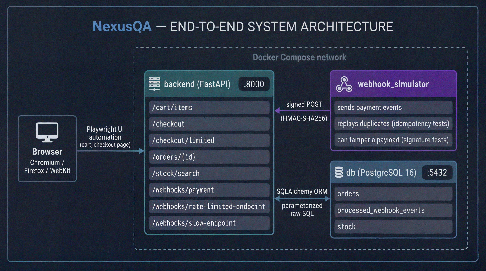

# NexusQA

A full-stack test and chaos resilience framework for an event-driven
e-commerce order and payment flow.

## What this proves

Payment systems fail in ways that only show up under real conditions:
webhooks get delivered twice, checkout requests arrive at the same
instant, malicious input gets sent on purpose and networks are slow or
drop connections. NexusQA is a mock backend built from scratch, paired
with a seven-layer automated test framework built specifically to catch
those failures, not just to prove the happy path works.

Several tests in this project follow a catch-then-fix pattern: a
deliberately naive implementation is written first, a test confirms it
fails, then the real fix is applied and the same test is confirmed
passing. That includes a genuine concurrency race condition that
oversold a limited-stock item (5 successful checkouts against a stock of 3) 
before being closed with an atomic database update, a SQL injection
vulnerability and an authorization bypass on order lookup.

## 🏛️ Architecture

See the full picture including the order-and-payment lifecycle, the
seven-layer test framework breakdown and how the codebase's files depend 
on each other in [docs/architecture.md](docs/architecture.md). 

## 📂 Repository structure
'''
nexusqa/
├── .github/
│   └── workflows/
│       └── ci.yml                     # multi-browser, gate-controlled pipeline
├── backend/                           # the mock system under test
│   ├── app/
│   │   ├── routes/
│   │   │   ├── cart.py
│   │   │   ├── checkout.py
│   │   │   ├── orders.py
│   │   │   └── webhooks.py
│   │   ├── db.py                      # DB connection/session logic
│   │   ├── main.py                    # FastAPI app entrypoint
│   │   └── models.py                  # Pydantic models (Order, WebhookEvent, etc.)
│   ├── Dockerfile
│   └── requirements.txt
├── docs/...
│
├── framework/                         # core reusable framework code
│   ├── pom/                           # Page Object Model base + page classes
│   │   ├── base_page.py
│   │   ├── cart_page.py
│   │   └── checkout_page.py
│   ├── api_client.py                  # HTTPX wrapper client
│   ├── config.py                      # base URLs, env-based settings (local vs CI)
│   ├── data_factories.py              # Faker-based synthetic data generation
│   └── db_helpers.py                  # direct SQL query helpers for verification
├── performance/                       # k6 scripts, separate from chaos
│   ├── checkout_load.js
│   └── webhook_load.js
├── reports/                           #gitignored, CI-published artifacts land here locally
│   └── .gitkeep
├── tests/
│   ├── chaos/                         # event-driven + resilience
│   │   ├── conftest.py
│   │   ├── test_concurrency_race_conditions.py
│   │   ├── test_corrupted_payloads.py
│   │   ├── test_latency_injection.py
│   │   ├── test_rate_limit_stress.py
│   │   ├── test_webhook_idempotency.py
│   │   └── test_webhook_signature_verification.py
│   ├── functional/                    # UI + API + contract tests
│   │   ├── conftest.py
│   │   ├── test_checkout_api.py
│   │   ├── test_checkout_ui.py
│   │   └── test_order_schema_contract.py
│   ├── security/                     
│   │   ├── conftest.py
│   │   ├── test_auth_rate_limit_abuse.py
│   │   ├── test_authz_bypass.py
│   │   ├── test_sensitive_data_exposure.py
│   │   └── test_sql_injection.py
│   └── conftest.py                    # root-level shared fixtures
├── webhook_simulator/                 # controllable fake Stripe
│   ├── Dockerfile
│   ├── requirements.txt
│   ├── signing.py                     # HMAC-SHA256 signature generation
│   └── simulator.py                   # sends signed webhook POSTs, supports delay/duplicate/corrupt modes
├── .env.example                       # documents required env vars, no real secrets
├── .gitignore
├── .pre-commit-config.yaml            # ruff + mypy hooks
├── docker-compose.yml                 # orchestrates backend + db + webhook_sim
├── LICENSE
├── pyproject.toml                     # ruff/mypy config, project metadata
├── pytest.ini                         # pytest config, markers for chaos/security/flaky tags
└── README.md
'''
## 🌀 Core concepts

**Idempotency** means processing the same event twice has no additional
effect the second time. so a retried payment never creates two orders.

A **race condition** is a bug that only exists because of timing. two
requests reading and writing shared data at nearly the same moment.

**Contract testing** checks that an API's actual response shape matches
what consumers expect, not just that it returned a 200.

**Chaos engineering** means deliberately injecting failure conditions like
duplicate events, corrupted payloads, latency, concurrency spikes to see how a 
system fails before it breaks by accident in production.

**Load vs. resilience vs. security testing** ask three different questions:
- **Load** (Layer 7, k6): ask does it stay fast under heavy but normal traffic?
- **Resilience** (Layer 3): ask if it stay correct under bad conditions like duplicates, delays
- **Security** (Layer 4) ask whether it resist malicious input

## 💡 How to run it

    git clone https://github.com/OlamiDiPupo-001/NexusQA.git
    cd NexusQA
    cp .env.example .env    
    docker compose up --build -d

    python -m venv .venv
    source .venv/Scripts/activate    # Windows Git Bash
    pip install -r requirements-dev.txt
    playwright install chromium firefox webkit

    NEXUSQA_BACKEND_URL=http://localhost:8000 pytest tests/ -v

See the full setup instructions and troubleshooting in [docs/setup-and-run.md](docs/setup-and-run.md).

Once the stack is running, `http://localhost:8000/docs` gives an
interactive, auto-generated view of every endpoint.

## 📊 Reports

All reports below are regenerated automatically on every push to main.

Functional and Security test results — Chromium [report.html](https://olamidipupo-001.github.io/NexusQA/chromium/report.html) 
Functional and Security test results — Firefox [report.html](https://olamidipupo-001.github.io/NexusQA/firefox/report.html) 
Functional and Security test results — WebKit [report.html](https://olamidipupo-001.github.io/NexusQA/webkit/report.html) 
Chaos test results [report.html](https://olamidipupo-001.github.io/NexusQA/chaos/report.html) 
Coverage [coverage/index.html](https://olamidipupo-001.github.io/NexusQA/chromium/coverage/index.html) 
k6 checkout load results [k6-checkout-summary.json](https://olamidipupo-001.github.io/NexusQA/k6/k6-checkout-summary.json) 
k6 webhook load results [k6-webhook-summary.json](https://olamidipupo-001.github.io/NexusQA/k6/k6-webhook-summary.json) 

## 🎯 Key metrics

- 21 automated tests across correctness, resilience, and security
- 85% code coverage across backend, framework, and simulator code
- A real concurrency race condition reproduced and closed with an
  atomic database update
- 100% rejection rate on invalid or tampered webhook signatures
- Checkout endpoint holds p95 latency under 150ms at 20 concurrent
  virtual users, against a measured baseline of 105ms

Every test, the file it lives in, and what it proves is listed in
[docs/test-case-catalog.md](docs/test-case-catalog.md).

## 🚧 Known limitations and future work

v1 covers the order and payment lifecycle only. Inventory and
fulfillment, user account management, and multi-product catalog
browsing are out of scope and AI-assisted test generation would 
be v2 targets.

The webhook load test measures raw endpoint throughput with signature
verification disabled, since replicating Python's HMAC computation
reliably in k6's JavaScript runtime was judged not worth the risk of
producing misleading numbers. The full reasoning is in
[docs/decisions.md](docs/decisions.md).

## 📚 Documentation

[docs/architecture.md](docs/architecture.md) — system diagrams, the
order and payment lifecycle, and the seven-layer test framework

[docs/dependency-hierarchy.md](docs/dependency-hierarchy.md) — what the
codebase's files import from each other and why

[docs/decisions.md](docs/decisions.md) — why the project is built the
way it is

[docs/challenges-and-solutions.md](docs/challenges-and-solutions.md) —
real bugs hit during the build, how each was diagnosed, and what fixed
it

[docs/test-case-catalog.md](docs/test-case-catalog.md) — every test,
mapped to what it proves

[docs/test-data-strategy.md](docs/test-data-strategy.md) — the policy
on never using real card numbers or real personal data anywhere in the
project

## ⚙️Tech stack

Python | FastAPI | SQLAlchemy 2.0 | Pydantic v2 | Playwright | HTTPX | Pytest | Tenacity | Docker | Docker Compose | GitHub Actions | k6 | pytest-html | pytest-cov | ruff | mypy | pre-commit

## License

MIT. See [LICENSE](LICENSE).