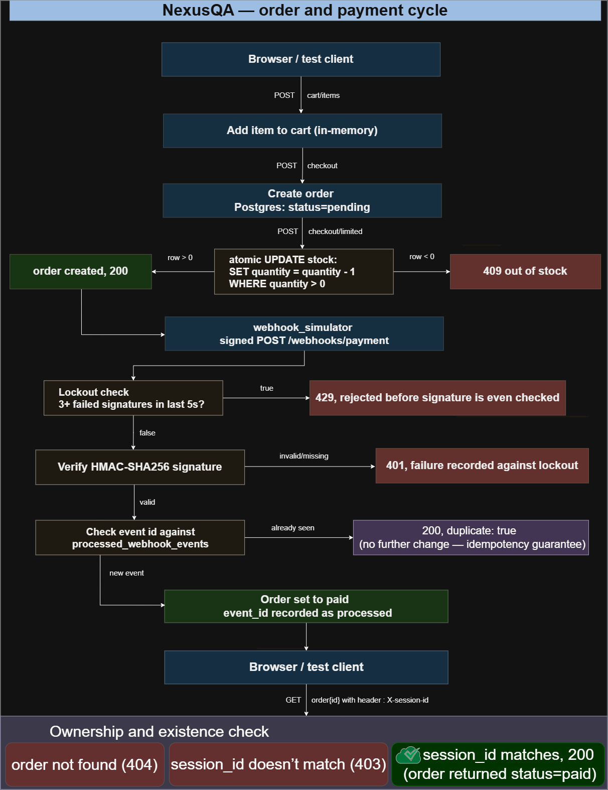
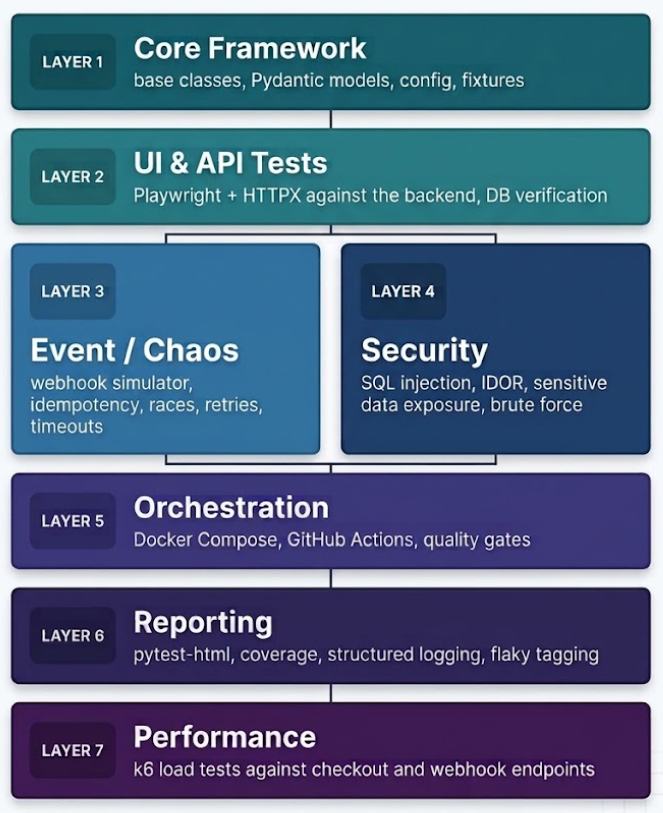

# NexusQA architecture

This document covers how the system is put together and how the test
framework maps onto it. For how the codebase's files depend on each
other, see [dependency-hierarchy.md](dependency-hierarchy.md). For how
things are named across the project, see
[naming-conventions.md](naming-conventions.md).

## System architecture

Three services run in Docker Compose on a shared network: `backend`
(FastAPI), `db` (Postgres), and `webhook_simulator`. The simulator
initiates every request toward the backend and never receives calls
back. It never touches the database directly either; its only job is building,
signing, and sending HTTP requests.

The backend's routes split into two groups. Most represent the real
order and payment flow: `/cart/items`, `/checkout`, `/orders/{id}`,
`/webhooks/payment`, `/stock/search`. A smaller set exists purely to
give specific tests something to call: `/checkout/limited` (used to
prove and then fix a concurrency race condition),
`/webhooks/rate-limited-endpoint`, and `/webhooks/slow-endpoint`. A
real integration would never call that second group.

## Order and payment lifecycle

This traces one request through every branch that actually exists in
the code, not just the path where everything succeeds. A webhook
delivery can be rejected for three separate reasons before it ever
reaches the order: too many recent failed signatures (429), an invalid
or missing signature (401), or if it passes both of those a
duplicate `event_id`, in which case it's accepted but makes no further
change. That last case is the idempotency guarantee this project is
built around. 

Order lookup has its own nonexistent order returns 409,
and a real order requested by a session that doesn't own it returns
403. Only the owning session gets the actual order data back.

## Seven-layer test framework

Layers 3 and 4 sit side by side rather than in sequence, since neither
depends on the other running first — both build directly on Layer 2's
working backend. Layers 1, 5, and 6 don't send requests to the system
at all: Layer 1 is what everything else imports, Layer 5 builds and
runs the environment, and Layer 6 observes whatever ran.

A full breakdown of every test, which file it lives in, and what it
proves is in [test-case-catalog.md](test-case-catalog.md).

## Other documentation

[decisions.md](decisions.md) —> why the project is built the way it is,
covering language and framework choices, the custom mock backend, and
several mid-build tooling decisions.

[challenges-and-solutions.md](challenges-and-solutions.md) —> real bugs
hit during the build, how each was diagnosed, and what fixed it.

[test-data-strategy.md](test-data-strategy.md) —> the policy on never
using real card numbers or real personal data anywhere in the project.

[setup-and-run.md](setup-and-run.md) —> full local setup instructions
and how the CI pipeline mirrors them step for step.